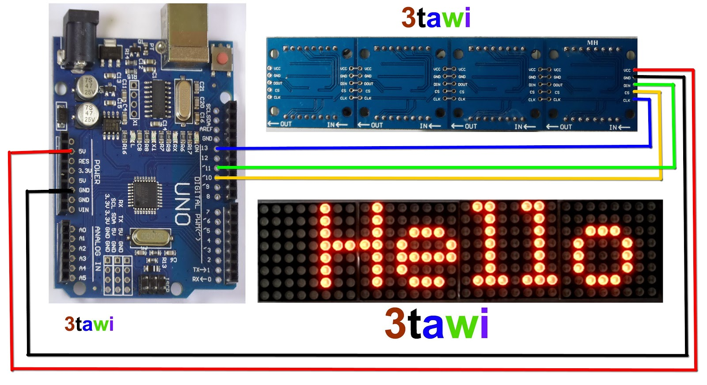
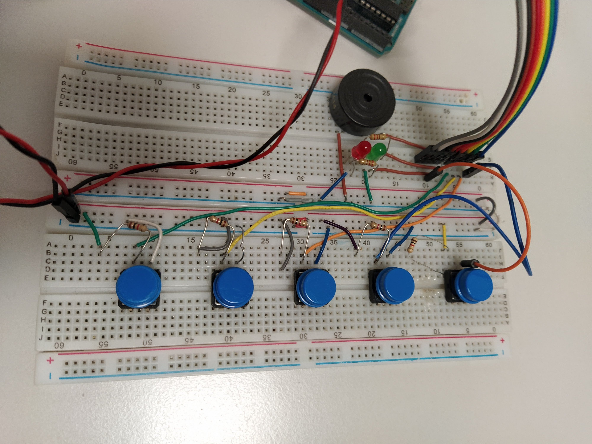

# Arduino Matrix

Arduino project using the 1088AS LED matrix module.

1088AS is an 8X8 red LED module. It is a modular component, meaning you can join as many modules as you like.

## Install libraries

I use few libraries depending on which programs you decide to use.

-   LedControl
    -   matrix1.ino
    -   matrix2.ino
    -   matrix2_reverse.ino
    -   matrix3.ino
    -   matrix4.ino
    -   matrix4_random.ino
    -   SimonSays.ino
-   MD_MAX72XX and MD_Parola
    -   matrix5.ino
    -   matrix6.ino

## Hardware

I'm using an Arduino UNO (for programs that use MD_MAX and MD_Parola it matters what model you're using) and a 4 module of the 1088AS.

### The Schema:

This schema uses the same ports I use in my code.

DIN -> 11

CS -> 10

CLK -> 13

# Simon Says project

The _SimonSays.ino_ file is different from all the others.

The other files are tests or proofs of concept for the library and the 1088AS matrix. But SimonSays is a big project that creates a fully functioning Simon says game for Arduino using the 1088AS matrix.

Video of the finished project working: https://youtu.be/FP_efhWCPdQ

## Hardware

List of components and the Arduino ports used:

| Component Name                     | Pin used |
| ---------------------------------- | -------- |
| Button0 (The one most to the left) | Pin 2    |
| Button1                            | Pin 3    |
| Button2                            | Pin 4    |
| Button3                            | Pin 5    |
| Buzzer                             | Pin 6    |
| Start button (Top red button)      | Pin 9    |
| Matrix (CS)                        | Pin 10   |
| Matrix (DIN)                       | Pin 11   |
| Matrix (CLK)                       | Pin 13   |

And a picture of the prototype circuit:

